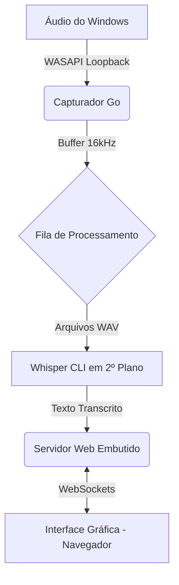

<div align="center">
  
  
  
</div>

<br>

# 🎙️ Transcriva

O **Transcriva** é uma ferramenta de código aberto, 100% offline e gratuita, focada em transcrever automaticamente **qualquer áudio reproduzido pelo seu computador** (Teams, Discord, Meet, Zoom, YouTube) usando Inteligência Artificial.

Sem limites de tempo, sem assinaturas e sem vazamento de dados. 

---

## 🎯 Por que o Transcriva foi criado?
No mercado atual, a maioria das ferramentas de transcrição (como os bots que entram em reuniões do Teams ou Zoom) exigem:
1. **Dinheiro:** Cobram mensalidades ou por minuto transcrito usando APIs na nuvem.
2. **Privacidade:** Enviam o áudio da sua empresa ou conversa confidencial para servidores de terceiros.
3. **Invasão:** Entram na sua reunião como um "Robô" visível para todos os participantes.

O **Transcriva** foi criado para resolver isso. Ele roda silenciosamente **na sua própria máquina**, captura o som diretamente da sua placa de áudio e transcreve tudo em texto usando inteligência artificial local. Nada sai do seu computador.

---

## 🏗️ Arquitetura e Como Funciona?

O projeto foi projetado para ser leve, não necessitar de compiladores C++ complexos (`CGO_ENABLED=0`) e rodar perfeitamente no Windows.



1. **Captura:** Utilizamos a API nativa do Windows (WASAPI) para interceptar qualquer som que saia nas suas caixas de som ou fones.
2. **IA:** Usamos o poderoso motor [whisper.cpp](https://github.com/ggerganov/whisper.cpp) como um *worker* em segundo plano, que é extremamente otimizado para rodar em processadores comuns sem precisar de placa de vídeo dedicada.
3. **Interface:** Em vez de usar bibliotecas pesadas de Desktop, o Transcriva levanta um Servidor Web local super leve e abre a interface no seu próprio navegador, se comunicando em tempo real via WebSockets.

---

## 👤 Para Usuários (O jeito mais fácil de usar)

Se você não é programador e quer apenas usar a ferramenta nas suas reuniões, siga os passos abaixo:

1. Acesse a seção **[Releases (Lançamentos)](https://github.com/yslanlopes12/Transcriva/releases)** do projeto (na lateral direita do GitHub).
2. Baixe o arquivo mais recente chamado `transcriva.exe`.
3. Crie uma pasta vazia no seu computador e coloque o `.exe` lá dentro.
4. **Dê um duplo clique!** 
   - Na primeira vez que você abrir, ele fará o download automático do cérebro da Inteligência Artificial (Modelo Whisper Medium - aprox. 1.5GB) e das ferramentas necessárias.
   - Assim que terminar, a interface bonita e moderna abrirá sozinha no seu navegador.
5. Basta clicar em **Iniciar Transcrição**!

> **💡 Dica:** No final da reunião, você pode usar o botão "Copiar" para copiar toda a ata formatada para a sua área de transferência, ou baixar o arquivo `.txt` e o `.wav`.

---

## 💻 Para Desenvolvedores

Se você quer rodar o código, testar modificações ou entender como ele foi feito, o setup é muito simples.

### Pré-requisitos
- **Golang 1.22** ou superior.
- Sistema Operacional **Windows 10 ou 11**.
- *(Não é necessário ter compilador GCC instalado!)*

### Como rodar localmente
1. Clone o repositório:
   ```bash
   git clone https://github.com/yslanlopes12/Transcriva.git
   cd Transcriva
   ```
2. Baixe as dependências do Go:
   ```bash
   go mod tidy
   ```
3. Rode o projeto:
   ```bash
   go run ./cmd/transcriva
   ```
*(Nota: Na primeira execução via código, ele também irá baixar os binários do whisper na pasta `/bin` e o modelo na pasta `/models`).*

### Comandos e Flags
Você pode rodar o executável ou o código fonte com algumas flags específicas:

* **Modo Web (Padrão):** 
  ```bash
  go run ./cmd/transcriva -mode gui
  ```
* **Modo Terminal:** Caso prefira uma interface *hacker* direto no Prompt de Comando, sem abrir o navegador:
  ```bash
  go run ./cmd/transcriva -mode cli
  ```

---

## 🤝 Como Contribuir (Open Source)

O Transcriva é de código aberto e adoraríamos a sua ajuda para melhorá-lo (novas funcionalidades, design, correções). Para contribuir:

1. Faça um **Fork** deste repositório (clicando no botão Fork lá em cima).
2. Clone o seu Fork para a sua máquina:
   ```bash
   git clone https://github.com/SEU_USUARIO/Transcriva.git
   ```
3. Crie uma *Branch* para a sua funcionalidade:
   ```bash
   git checkout -b feature/minha-nova-funcionalidade
   ```
4. Faça o commit das suas alterações:
   ```bash
   git commit -m "feat: adiciona tradução em tempo real"
   ```
5. Envie (push) para a sua branch:
   ```bash
   git push origin feature/minha-nova-funcionalidade
   ```
6. Abra um **Pull Request** no repositório original.

🛡️ **Pipeline CI/CD Automática:** Nosso projeto possui GitHub Actions! Assim que você abrir o Pull Request, nossos robôs testarão o seu código automaticamente para garantir que ele compila certinho no Windows.

---

<p align="center">
  Feito com dedicação para quem preza pela privacidade. 🚀<br>
  Distribuído sob a licença MIT.
</p>
